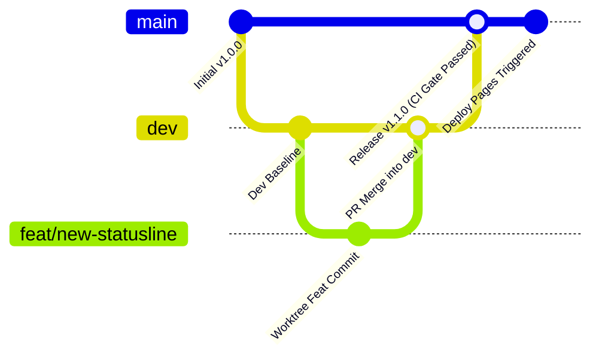

# Contributing to AGY PowerPack

Thank you for contributing to **AGY PowerPack**! This project welcomes contributions from both human engineers and autonomous agent bots (Gemini Antigravity, OpenAI Codex, Claude Code, OpenCode).

To ensure stability, fast turnaround, and zero regressions, we enforce a strict **Git Worktree Isolation Methodology** and automated verification gates.

---

## 🌳 Git Worktree Isolation Methodology (Mandatory)

Never work directly on `main` or `dev` in your root working directory. Every epic, feature, bugfix, or bot maintenance task MUST be developed inside a dedicated Git Worktree:

### 1. Create a Worktree
Use the bundled utility script to provision an isolated worktree rooted under `worktrees/`:

```bash
./scripts/dev-worktree.sh new <branch-type>/<short-name>
```

Branch naming conventions:
- `feat/<description>`: New features or enhancements
- `fix/<description>`: Bug fixes and performance adjustments
- `bot/<description>`: Autonomous AI agent pull requests
- `docs/<description>`: Documentation additions or updates

### 2. Enter and Develop in the Worktree
```bash
cd worktrees/<branch-type>/<short-name>
```
Your root repository remains clean on its current branch, while the worktree has its own checked-out branch, staging area, and working tree.

### 3. Local Verification Suite
Before committing or pushing, run the entire test suite inside the worktree:
```bash
# 1. Syntax checks
python3 -m py_compile scripts/*.py tests/*.py
bash -n scripts/*.sh tests/*.sh install.sh uninstall.sh

# 2. Python unit tests
python3 -m unittest discover -s tests -p "test_*.py" -v

# 3. End-to-end hook contract tests
./tests/test_hooks.sh

# 4. Antigravity plugin manifest validation
agy plugin validate .
```

### 4. Commit and Push
```bash
git add .
git commit -m "feat(statusline): add custom threshold coloring"
git push -u origin <branch-type>/<short-name>
```

### 5. Worktree Teardown
Once the pull request is merged into `dev`:
```bash
cd ../..
./scripts/dev-worktree.sh remove <branch-type>/<short-name>
```

---

## 🔀 Branching Strategy & Deployment Flow



1. **`main`**: Protected branch. Represents stable production releases. Direct commits are disallowed.
2. **`dev`**: Active integration branch. All Pull Requests from humans and bots must target `dev`.
3. **Automated Deployments**:
   - Pushes to `main` trigger `.github/workflows/deploy-pages.yml`.
   - **Strict Gate**: The documentation website is deployed to GitHub Pages **ONLY IF** the `verify` job (syntax checks, unit tests, hook contract) passes 100%.

---

## 🤖 Guidelines for Autonomous AI Agents & Bots

Autonomous agents operating on this repository must adhere to the following standards:

1. **Fill the Standard PR Template**: Always use `.github/PULL_REQUEST_TEMPLATE.md`. Set `Contributor Type: [x] Autonomous Agent Bot` and specify the agent runtime version.
2. **Atomic Commits**: Keep changes minimal, focused, and semantically titled (`feat: ...`, `fix: ...`, `chore: ...`).
3. **Preserve Security Contracts**:
   - `PreToolUse` hooks must ALWAYS return a JSON response with `"decision": "allow"` or `"decision": "ask"`.
   - Never remove or weaken critical patterns in `CRITICAL_COMMAND_PATTERNS`.
   - Any script executed during hooks must complete in **< 50ms** to prevent UI stutter in the terminal.

---

## 🧪 Adding New Tests

- Tests for classifier and safety regexes belong in `tests/test_classifier.py`.
- Tests for statusline ANSI formatting, quota parsing, and duration math belong in `tests/test_statusline.py`.
- Integration contracts for stdin/stdout hooks belong in `tests/test_hooks.sh`.
