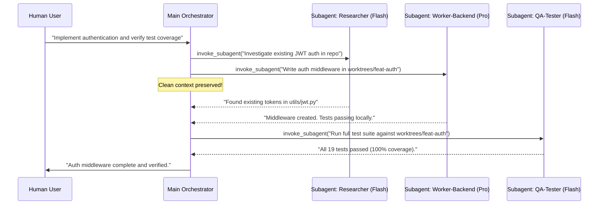

# Multi-Agent Delegation & Parallel Execution Reference

This document defines the architectural patterns and best practices for orchestrating multi-agent systems in Google Antigravity CLI (`agy`), inspired by modern distributed agentic systems.

---

## 1. Why Delegate? Context Window Preservation

A major bottleneck in large-scale agentic development is **context rot**:
- As a single agent executes dozens of commands, reads large files, and iterates on code, its 200,000-token context window accumulates noise (compiler logs, raw diffs, grep snippets).
- Over long sessions, high token usage increases latency, costs, and degradations in reasoning quality.

### The Antigravity Solution: Specialized Subagents
By delegating heavy exploration, testing, and implementation to independent subagents:
1. **Context Isolation**: Each subagent starts with a fresh, clean context tailored strictly to its task.
2. **Parallel Speed**: Independent tasks execute concurrently in the background.
3. **Cost Optimization**: Lightweight research tasks run on **Gemini Flash**, while complex architectural decisions use **Gemini Pro**.

---

## 2. Bundled Subagent Catalog (`agents/`)

`agy-powerpack` bundles 5 specialized agent definitions:

| Subagent | Default Model | Primary Tools | Purpose |
| :--- | :--- | :--- | :--- |
| **`researcher`** | `flash` | `view_file`, `list_dir`, `grep_search`, `read_url_content`, `search_web` | Codebase exploration, web searches, documentation synthesis. Never modifies files. |
| **`worker-backend`** | `inherit` | Workspace edits, backend test execution | Server, logic, API, and database implementation within an assigned worktree. |
| **`worker-frontend`** | `inherit` | Workspace edits, UI/CSS preview | Presentation layer, component styling, and frontend tests. |
| **`qa-tester`** | `flash` | `run_command`, test runners | Automated test execution, coverage auditing, and regression detection. |
| **`reviewer-bot`** | `flash` / `pro` | Diffs, static analysis | Compliance, security verification, and code quality review before merge. |

---

## 3. Delegation Patterns

### Pattern 1: Fork & Join (Concurrent Subtasks)
When an epic contains multiple decoupled tasks (e.g. backend endpoint + frontend mock + QA suite):
1. The orchestrator decomposes the epic into 3 subagent prompts.
2. Calls `invoke_subagent` with all 3 subagents in a single turn.
3. The orchestrator stops calling tools; the messaging runtime automatically wakes the orchestrator up when subagents reply.
4. The orchestrator joins the outputs and presents the final summary to the user.



### Pattern 2: Worker Pool (Iterative Conversation)
- Instead of repeatedly spawning new subagents, send additional instructions to existing subagent IDs via `send_message(Recipient="<conv-id>", Message="...")`.
- This preserves the subagent's localized memory while keeping the orchestrator's history compact.

### Pattern 3: Reviewer Gate
- Any autonomous code generated by a bot or worker subagent is reviewed by `reviewer-bot` before proposing a Pull Request or merge into `dev`.

---

## 4. Example Orchestration Prompt Template

```markdown
You are the Orchestrator. When delegating:
1. State the objective clearly to each subagent.
2. Provide exact file paths and boundaries.
3. Require the subagent to report only the summary of changes and test outcomes.
4. Do not poll in a loop; wait for the runtime wakeup.
```
